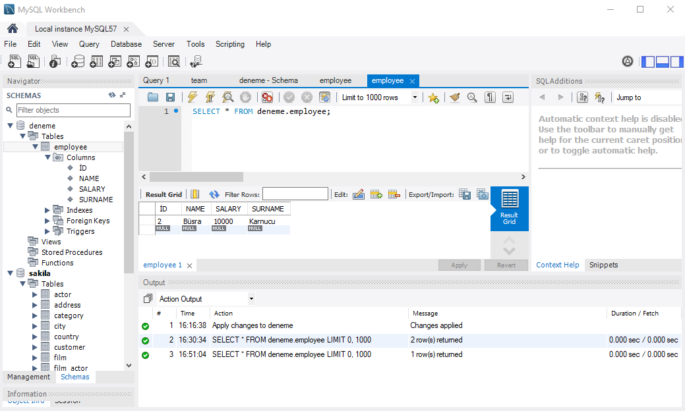

= JPA-EclipseLink-MySQL-example

EclipseLink JPA kullanılarak yazılan örnek bir uygulama.

== Program Çıktısı

Eklenen : 1 - Samed - Savas - 1000
Eklenen : 2 - Büşra - Karnucu - 10000
Eklenen : 3 - Ahmet - Balcı - 10000

3 ID No'lu kullanıcı : 3 - Ahmet - Balcı - 10000

Maaşı güncellenen 1 ID no'lu kullanıcı : Samed Savas

3 ID no'lu kullanıcı silindi.

Veri tabanındaki tüm kullanıcılar
1 - Samed - Savas - 2000
2 - Büşra - Karnucu - 10000

1 ID no'lu kullanıcı silindi.

Veri tabanındaki tüm kullanıcılar
2 - Büşra - Karnucu - 10000

== MySQL Workbench Çıktısı : 

